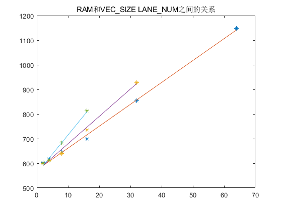
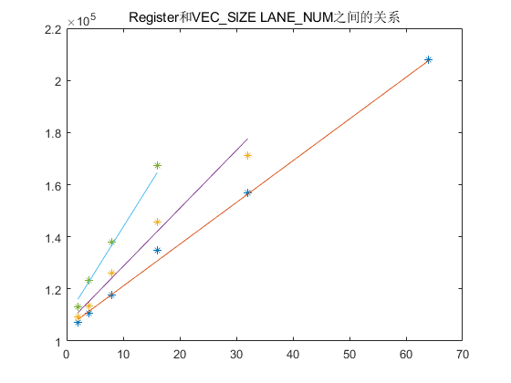
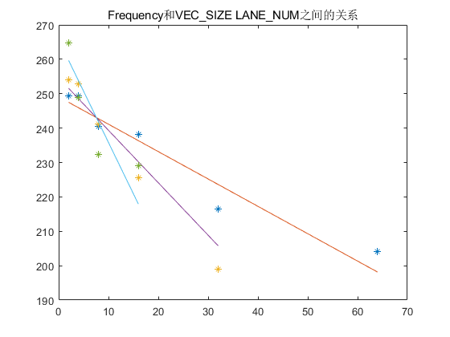

# PipeCNN设计空间探索
文件中有些公式，可能在github上预览效果不好，可以使用typora软件下载后查看；另外文中的实验数据是以加了profile命令编译的，所以资源消耗偏大一些。我会在跑完新的实验后更新实验数据。
## 1. PipeCNN并行度分析
在阐述PipeCNN的并行性之前，我们首先探讨每一层的计算量，由于全连接操作均转化为卷积操作，所以本文主要讨论卷积运算。假设输入特征图的尺寸为`W*H*N`，卷积核尺寸为`K*K*N*M`，输出卷积结果为`R*C*M`，则为了得到一个卷积输出特征值需要进行的乘法数量为`K*K*N`，之后对`K*K*N`个数进行相加所需的加法数量为`K*K*N-1`，最终再加上`bias`，所以一共需要的运算数目为`2*K*K*N`。而卷积输出的尺寸为`R*C*M`，所以这一层卷积的总共计算量为`2*K*K*N*R*C*M`

为了加速计算，PipeCNN框架有两个并行度，即`VEC_SIZE`和`LANE_NUM`，**即有`LANE_NUM`个卷积核同时进行卷积**操作，而在每个卷积核进行卷积时，**同时有`VEC_SIZE`个数进行加乘操作**，即计算一次就会有`2*VEC_SIZE*LANE_NUM`个乘累加操作，若系统的频率为`Freq`则每一层卷积所需要的时间为
$$
T_{conv}^{l}=\frac{2*K*K*N*R*C*M}{2*VEC\_SIZE*LANE\_NUM*Freq} \tag{1}
$$
从上式可以看出，当`VEC_SIZE`和`LANE_NUM`选择合适时，会大大加快卷积计算速度。但是一味增大这两个参数并不会缩短运行时间，接下来我们通过计算来进行探究。
## 2. 每一层性能瓶颈的分析
为了减小读取数据时的延时，PipeCNN框架采用了`win_buffer`来缓冲数据，并且使用`ping-pong buffer`。对于每层网络而言，需要将输入分为几个组，每组输入特征的大小为`conv_win_size_dim1x2x3`对应`CONV_GP_SIZE*1*LANE_NUM`个卷积输出特征(PipeCNN中没有Y方向的数据重用)，分别对各个组进行卷积，将所有组的卷积结果合并成最后的输出。在每组内需要做两个事情：1. 读取**输入特征**和**权重数据** 2. 进行卷积运算。首先我们分别对每组中这两种操作所需要的理论时间进行计算。

读取**每个GROUP**对应数据所需要的时间：分为从DDR内存中读取输入特征和读取权重的时间，读取输入特征的时间为
$$
t_{data}=\frac{[(CONV\_GP\_SIZE\_X-1)*S+K]*K*N*DATA\_WIDTH}{DDR\_BANDWIDTH}
$$
其中S为卷积核的步长，DATA_WIDTH为数据的宽度，DDR_BANDWIDTH为DDR内存的带宽。
读取**每个GROUP**对应权重的时间为
$$
t_{weight}=\frac{K*K*N*LANE\_NUM*DATA\_WIDTH}{DDR\_BANDWIDTH}
$$
对于**每个GROUP**进行卷积所需要的时间为
$$
t_{conv}=\frac{K*K*N*CONV\_GP\_SIZE*LANE\_NUM}{LANE\_NUM*VEC\_SIZE*FREQUENCY}
$$
在读取**每个GROUP**所需要的时间在下图中用黄色柱状图表示，对**每个GROUP**进行卷积所需要的时间在下图中用蓝色柱状图表示，可以看出来，在Alexnet的前几个卷积层，卷积时间大于读取权重的时间，所以前5层的性能瓶颈在于卷积速度。而6、7、8三层的全连接层，读取数据的时间要远远大于计算时间，所以这时的性能瓶颈在于数据的读取。

普通卷积层每组读取数据所消耗时间和每组卷积所消耗时间的示意图如下，可以看出卷积时间大于从DDR内存读取数据的时间，所以性能瓶颈在于卷积操作，该层所消耗的时间可以用公式(1)进行计算。
$$
T_{conv}^{l}=\frac{2*K*K*N*R*C*M}{2*VEC\_SIZE*LANE\_NUM*Freq} \tag{1}
$$

对于**全连接层**而言示意图如下，可以看出读取数据和权重所需要的时间远大于计算时间，所以性能瓶颈在于读取数据操作。

全连接层输入数据的维度为`K*K*N`，权重维度为`K*K*N*M`，该层所消耗的时间可以用如下公式进行计算
$$
T_{read}^{l}=\frac{(K*K*N*M+K*K*N)*DATA\_WIDTH}{DDR\_BANDWIDTH}  \tag{2}
$$
采用这种模型分别对卷积层和全连接层的时间消耗进行建模，可以得出每层时间消耗

层数|理论时间消耗|实际时间消耗|效率
----|-----------|-----------|-
1   |18.91|19.57|0.97
2   |7.53|7.96|0.95
3   |5.03|5.22|0.96
4   |3.77|3.94|0.96
5   |2.51|2.64|0.95
6   |1.58|2.57|0.61
7   |0.70|1.17|0.60
8   |0.18|0.32|0.56

## 2. 对`VEC_SIZE`和`LANE_NUM`进行探索
### 2.1 网络参数对VEC_SIZE和LANE_NUM的约束
VEC_SIZE 和 LANE_NUM 的选取首先需要和网络参数匹配，分别需要满足以下几点。
1. VEC_SIZE需要同是时各层输入通道数的公约数：PipeCNN框架中，除了对输入层有在第三个维度(N)上的补零之外，其余各层都需要同时是VEC_SIZE的倍数，即每一层的N都可以被VEC_SIZE整除。能满足这个要求的只有[4, 8, 16]
2. 在`layer_config[ll][conv_split]==1`时，需要`np.mod(np.ceil(layer_config[ll][weight_m]/lan_num),2)==0`。能满足该要求的有[2, 3, 4, 8, 12, 13, 15, 16, 22, 28, 32, 33, 34, 48, 49, 50, 51, 64, 65, 66, 67, 68, 69, 70, 71, 72, 73, 74, 75, 76]
### 2.2 DSP数量对VEC_SIZE和LANE_NUM的约束
TODO：
- [ ] 何种情况下会消耗DSP

DSP一个重要的去向就是进行卷积运算，因为PipeCNN中，每个时刻都有$VEC\_SIZE\times LANE\_NUM$个$MAC$运算，而一个DSP可以处理两个8bit MAC运算，所以在进行卷积运算时需要消耗的DSP数量为$VEC\_SIZE\times LANE\_NUM/2$。而其他内核也会消耗一部分DSP，比如在memRead内核中的counter在计算时也会消耗一部分DSP，这部分DSP的用量可以用一个常数C来表示，所以总的DSP消耗量可以用以下等式估算
$$
\#\{DSP\}=VEC\_SIZE\times LANE\_NUM/2+C
$$

De5net开发板上测试的数据如图，根据在De5_net 开发板上的测试结果，常数C在50-51之间，matlab计算得到C=50.45。根据这个等式可以根据DSP的总量和VEC_SIZE来计算LANE_NUM的上限值。De5net的DSP数量是256个，则256-50.5=vec*lane/2。所以当vec=16时，lane=25；vec = 8时lane=51，vec=4时，lane=102。

### 2.3 RAM资源对VEC_SIZE和LANE_NUM的约束

根据由De5net的实验结果，经过线性回归得到如图所示拟合结果，并且得到RAM用量的表达式

$$
\#\{RAM\} = 583 - 1.6*VEC\_SIZE +6*LANE\_NUM+0.6*VEC\_SIZE*LANE\_NUM
$$
De5net有2560个RAM，如果只用其中70%的RAM资源，分别将vec=16，8，4带入得到最大的$LANE\_NUM=79, 113, 144$

### 2.4 寄存器资源对VEC_SIZE和LANE_NUM的约束

$$
reg=103743 + 335 * VEC\_SIZE + 980 * LANE\_NUM+155*VEC\_SIZE*LANE\_NUM
$$

### 2.5 逻辑资源对VEC_SIZE和LANE_NUM的约束

$$
log=63810+118*VEC\_SIZE+619*LANE\_NUM+69*VEC\_SIZE*LANE\_NUM
$$
De5net中逻辑资源为234720
### 2.6 运行频率对VEC_SIZE和LANE_NUM的约束

$$
Fre=249.6+0.85*VEC\_SIZE-0.71*LANE\_NUM-0.12*VEC\_SIZE*LANE\_NUM
$$
这里取最低频率180，分别将vec=16，8，4带入，则LANE_NUM=31，45，60
### 2.7 综合以上所有因素
为了不超过硬件资源限制，分别计算不同的VEC_SIZE和对应的LANE_NUM，得到如下表格
VEC_SIZE|DSP|RAM(70%)|LOG(70%)|FREQ(190)|Min
-|-|-|-|-|-
16|25|79|57|25|25
8|51|110|85|42|42
4|102|137|111|74|74
再结合网络的参数约束，再对VEC_SIZE和LANE_NUM不同的组合进行硬件编译，并运行得到[实验结果](./PipeCNN_note_resource/de5Alexnet.xlsx)。发现当LAnE_NUM为2的幂次时，消耗的资源较少，而且性能较高。

由于这几天FPGA板子没法跑，所以用计算表1时使用的模型计算了一下性能

## 3. 其他影响性能的因素
1. DDR内存的带宽限制：根据数据手册，De5_net板子上的DDR内存的带宽为94.5gbit/s，根据上面对每个GROUP运行时间进行分析可以知道，在最后三层的全连接层，限制速度的组要因素为**从global memory向local memory读取数据的速度较卷积操作慢**
2. 提高VEC_SIZE和LANE_NUM所带来的无效操作的增加
